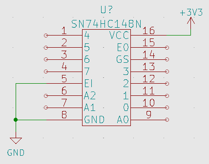

# Texas Instruments SN74HC148N 8:3 Encoder

The SNx4HC148 is an 8-input priority encoder. Added input enable (EI) and output enable (EO) signals allow for cascading multiple stages without added external circuitry.

### SN74HC184N Truth Table (Active Low)

<table>
<tr><th>Inputs</th><th>Outputs</th></tr>
<tr><td>

| EI | D0 | D1 | D2 | D3 | D4 | D5 | D6 | D7 |
| - | - | - | - | - | - | - | - | - |
| H | X | X | X | X | X | X | X | X |
| L | H | H | H | H | H | H | H | H | 
| L | X | X | X | X | X | X | X | L | 
| L | X | X | X | X | X | X | L | H | 
| L | X | X | X | X | X | L | H | H | 
| L | X | X | X | X | L | H | H | H | 
| L | X | X | X | L | H | H | H | H | 
| L | X | X | L | H | H | H | H | H | 
| L | X | L | H | H | H | H | H | H | 
| L | L | H | H | H | H | H | H | H | 

</td><td>

| A2 | A1 | A0 | GS | EO |
| - | - | - | - | - |
| H | H | H | H | H |
| H | H | H | H | L |
| L | L | L | L | H |
| L | L | H | L | H |
| L | H | L | L | H |
| L | H | H | L | H |
| H | L | L | L | H |
| H | L | H | L | H |
| H | H | L | L | H |
| H | H | H | L | H |

</td></tr> </table>

### Symbol and Pinout
This device runs on any voltage between 2V and 6V: we will be using 3.3V for our application. EI (Enable Input) must be pulled to GND in order to be active. GS (Get Signal) and EO (Enable Output) will change based on the inputs that the chip recieves - use the above truth table to determine the exact digital logic. The symbol to the left of this paragraph block matches the real-world pinout of the device. If you want more information, please consult the [device datasheet](../Datasheets/SN74HC148N.pdf).

